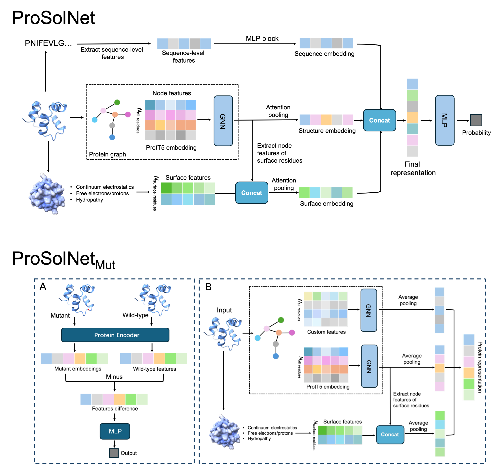

# ProSolNet

Protein solubility is a key property of broad interest in protein engineering. Based on protein three-dimensional structures and sequences, we extracted global features, graph-based features, and surface features, and developed two deep learning models, ProSolNet and ProSolNet_mut, to predict protein solubility and solubility changes induced by mutations, respectively. 

## Conda environment
The environment of ProSolNet/ProSolNet_Mut can be created using Conda, and the main packages are as follows:

        torch==2.6.0+cu126
        torch-scatter==2.1.2+pt26cu126
        torch-geometric==2.7.0
        biopython==1.86
        mdtraj==1.10.3
        numpy==2.2.6
        pandas==2.3.3
        transformers==4.57.1
        pyrosetta==2024.39+release.59628fb

More detailed environment information is provided in xxx

## Usage
### 1. Generate features
Since ProSolNet nad ProSolNet_Mut take multimodal features as input, the required dependencies need to be configured locally before runing the models. For example, global sequence-level features rely on TMHMM and USEARCH; node features of the protein graph rely on the protein language model [Prot_t5_xl_uniref50](https://huggingface.co/Rostlab/prot_t5_xl_uniref50/tree/main); protein surface features rely on MaSIF; and the generation of 3D structures for protein mutants depends on PyRosetta.

|     |  Dependencies   |
|---------------|-----------|
|   Global features   |   TMHMM, USEARCH  |
|   Surface features  | MaSIF |
|   Protein language model  | Prot_t5_xl_uniref50 |
|   Mutant structure  | PyRosetta |

The detailed feature generation process is presented in `./generate_features/ProSolNet` and `./generate_features/ProSolNet_mut`.

### 2. Inference
After feature extraction, run `bash run_inference.sh` in the `./inference/ProSolNet` and `./inference/ProSolNet_mut` directories to perform prediction.

### 3. Training
Before training the model, you first need to generate features for the dataset by following the feature extraction procedure described in Step 1. Then, train the model using the scripts in the `./ProSolNet/training` and `./ProSolNet_mut/training` directories, as shown below

        bash run_training.sh
